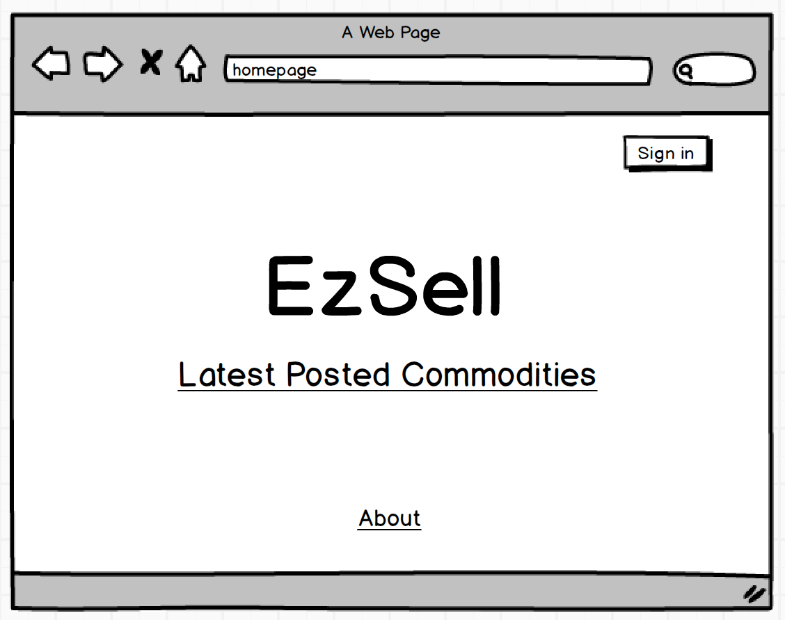
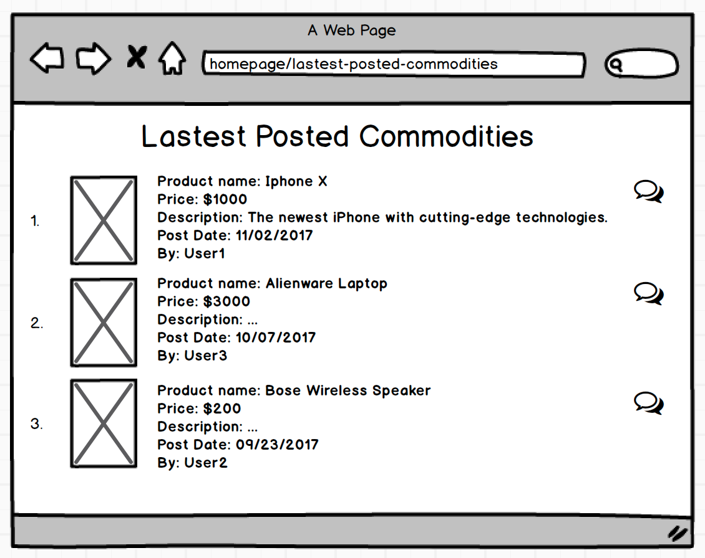
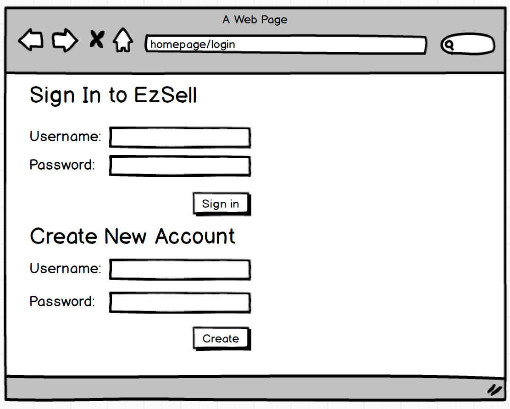
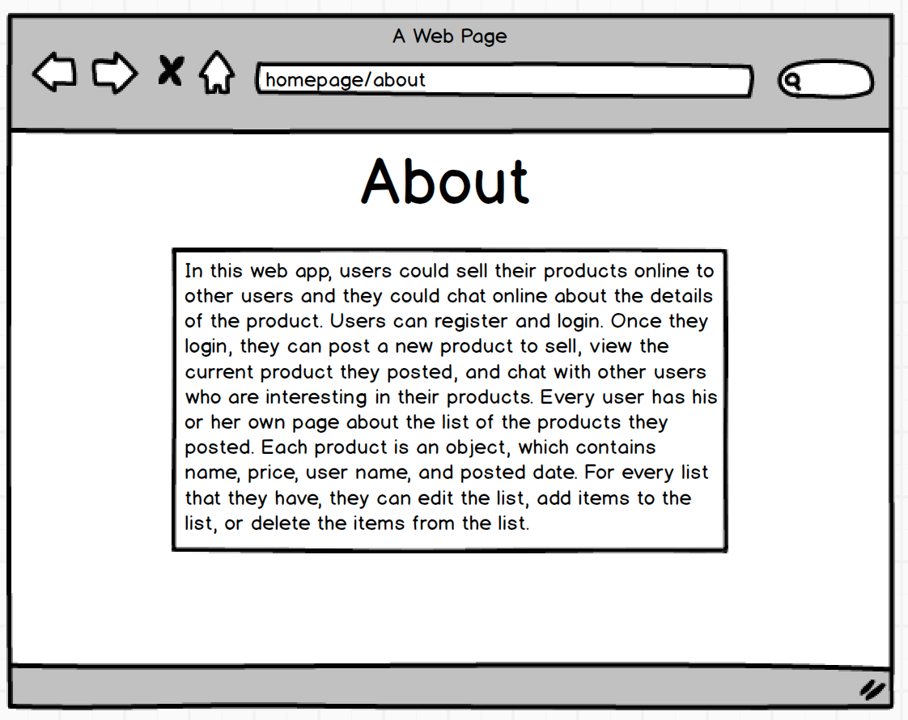
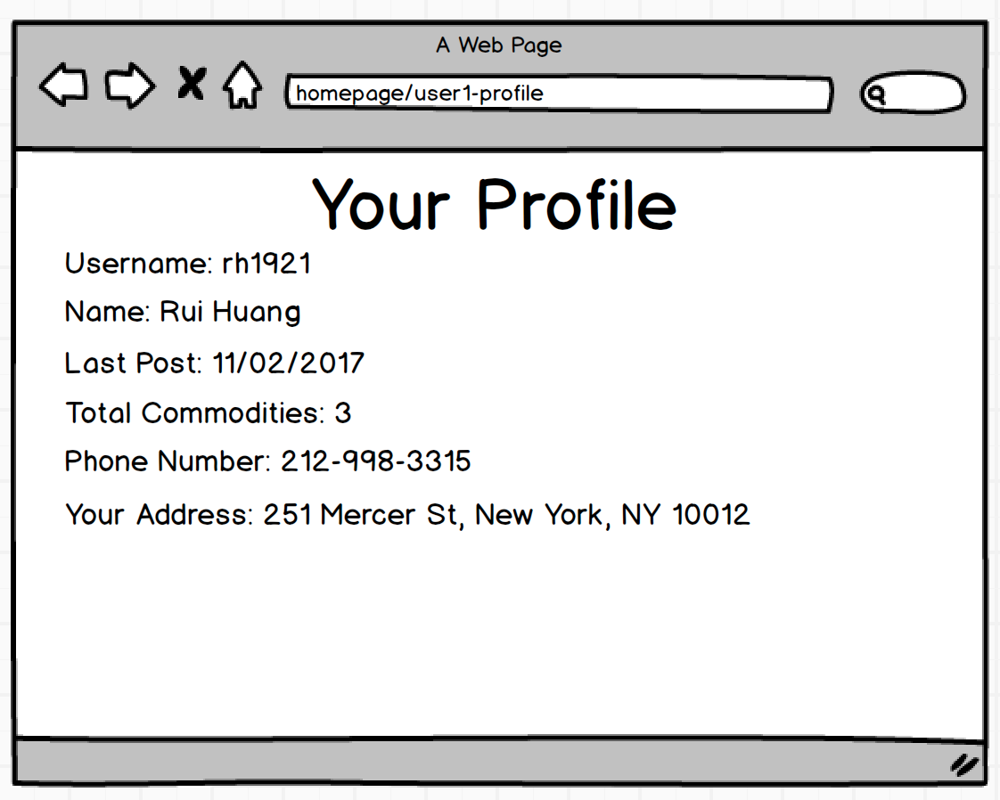
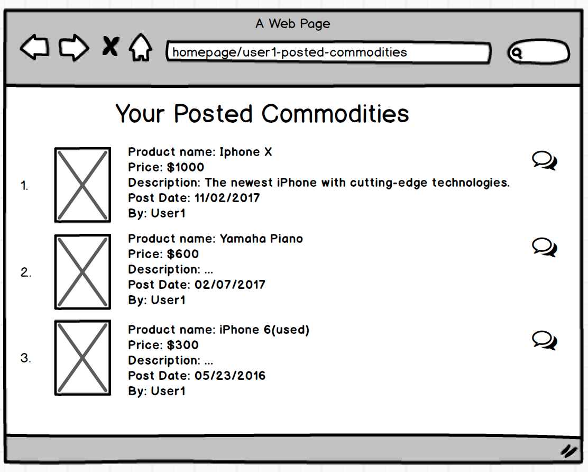
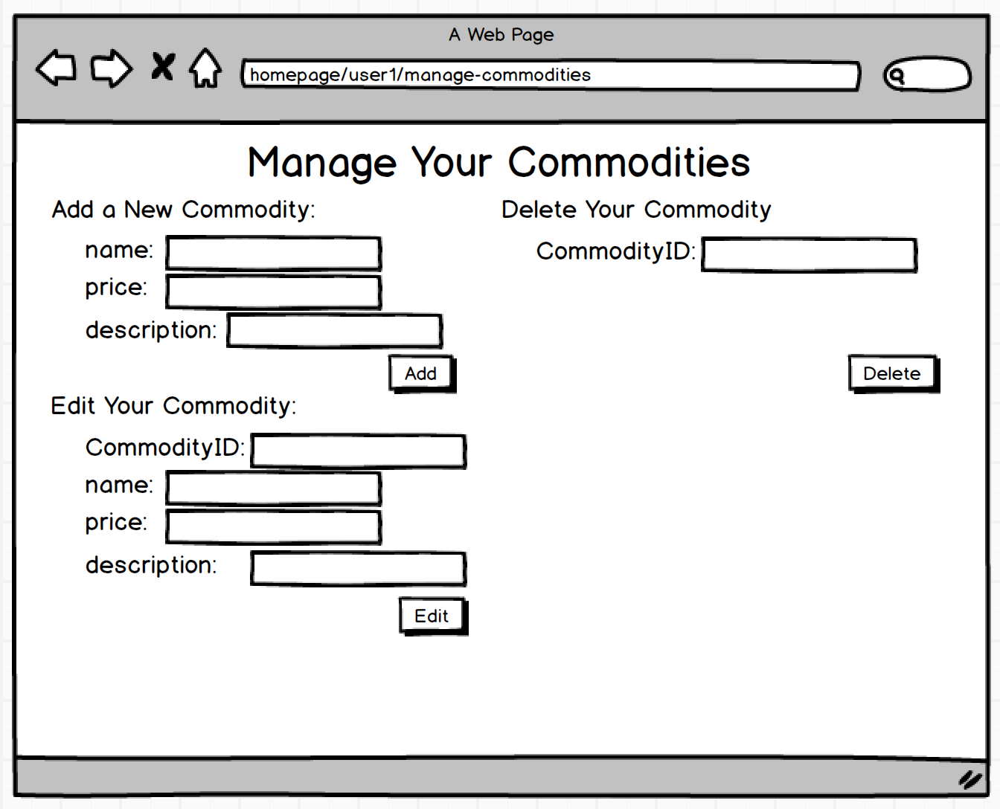
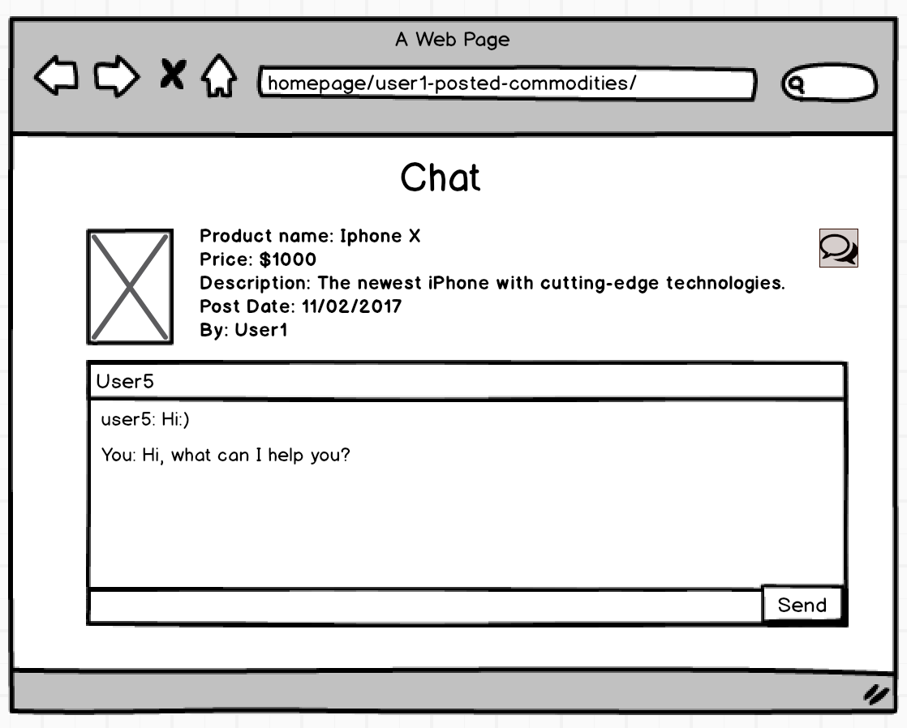
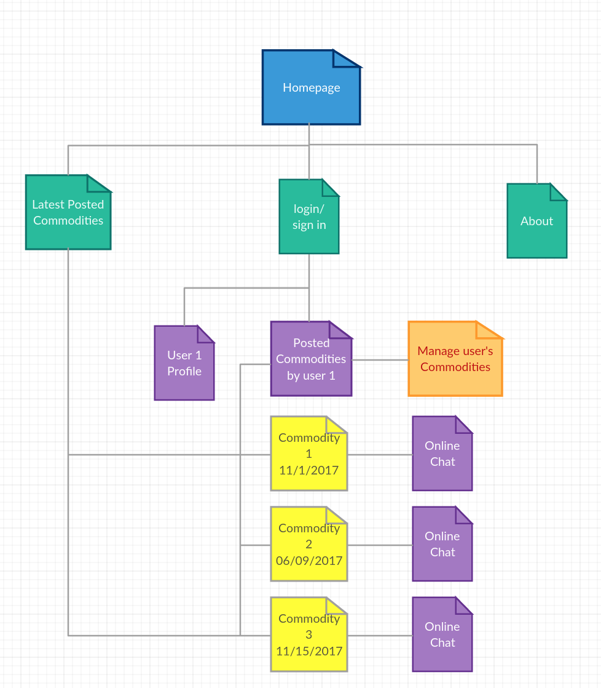

# EzSell

## Overview

Usually, when you buy a commodity online, you cannot ask seller about the detail of the commodity timely. Sometimes, you would buy a thing that you don't like, and you have to return it. It is so complicated.

In this web app, users could sell their products online to other users and they could chat online about the details of the product. Users can register and login. Once they login, they can post a new product to sell, view the current product they posted, and chat with other users who are interesting in their products. Every user has his or her own page about the list of the products they posted. Each product is an object, which contains name, price, user name, and posted date. For every list that they have, they can edit the list, add items to the list, or delete the items from the list.


## Data Model

The application will store Users, Lists, Posted commodity, and the Chat History,

* users can have multiple commodities (via references)
* each user has an address (by embedding)
* each commodity can have multiple messages (by embedding)


An Example User:

```javascript
{
  username: "someone",
  hash: // a password hash,
  latest_postedAt: //timestamp
  phone: 2341539830,
  address: [{
      street_address: "251 Mercer St",
      city: "New York",
      state: "NY",
      zip_code: 10012
  }],
  commodities: // an array of references to List documents
}
```

An Example List with Embedded Message hisotry:

```javascript
{
  user: // a reference to a User object
  commodityID: 213DSE3212,
  name: "Apple iPhone X",
  price: "$1000",
  description: "The newest iPhone with cutting-edge technologies."
  postedAt: 10/27/2017 8:30// timestamp
  message: [
      {sender: user2, content: "Hi, when could you ship this item", time_created: 10/28/2017 8:23},
      {sender: user1, content:"By next weekend", time_created: 10/28/2017 8:30},
      {sender: user2, content:"Ok, sounds good. I will buy it.", time_created: 10/28/2017 8:32},
      {sender: user1, content: "Thank you.", time_created: 10/28/2017 8:35},
      {sender: user3, content: "What color options for this iPhone", time_created: 10/29/2017 11:54},
      {sender: user1, content: "Black and White", time_created: 10/29/2017 12:01},
      {sender: user3, content: "Oh, I prefer dark blue", time_created: 10/29/2017 12:05},
      {sender: user1, content: "Sorry we don't have this option.", itme_created: 10/29/2017 12:06}]
}
```


## [Link to Commented First Draft Schema](src/EzSell/db.js) 


## Wireframes


/homepage - page for showing the homepage



/homepage/lastest-posted-commodities - page for lastest posted commodities



/homepage/login - page for login or signup 



/homepage/about - page for showing the introduction to this program



/homepage/user1/profile - page for user's profile



/homepage/user1/posted-commodities - page for user's posted commodities



/homepage/user1/manage-commodities - page for managing user's posted commodities



homepage/user1//commodityID=1243HSD8212/chat-with-user5 - page for online chatting



## Site map



## User Stories or Use Cases

1. as non-registered user, I can register a new account with the site
2. as a user, I can log in to the site
3. as a user, I can post a commodity
4. as a user, I can edit a commodity
5. as a user, I can delete a commodity
6. as a user, I can view the commodities I posted.
6. as a user, I can chat with other users for each commodity in a separate chat session.
7. as a user, I can view the chat history.


## Research Topics


* (5 points) Integrate user authentication
    * I'm going to be using passport for user authentication
    * And account has been made for testing; I'll email you the password
    * see <code>cs.nyu.edu/~jversoza/ait-final/register</code> for register page
    * see <code>cs.nyu.edu/~jversoza/ait-final/login</code> for login page
    
* (2 points) Bootstrap.js
    * Bootstrap is a free and open-source front-end web framework for designing websites and web applications. 
    * It contains HTML- and CSS-based design templates for typography, forms, buttons, navigation and other interface components, as well as optional JavaScript extensions. 
    * Unlike many web frameworks, it concerns itself with front-end development only.

* (? points) Real time chat app
    * I will create a basic chat application
    * Integrating Socket.IO(socket.io and socket.io-client)
    * Sockets have traditionally been the solution around which most realtime chat systems are architected, providing a bi-directional communication channel between a client and a server.
    * This means that the server can push messages to clients. Whenever you write a chat message, the idea is that the server will get it and push it to all other connected clients.

## [Link to Initial Main Project File](src/EzSell/app.js) 


## Annotations / References Used

1. [passport.js authentication docs](http://passportjs.org/docs)
2. [getbootstrap.com](http://getbootstrap.com/docs/4.0/getting-started/introduction/)
3. [Chat application sockeit.io](https://socket.io/get-started/chat/)
   [Chat application FreeCodeCamp](https://medium.freecodecamp.org/building-a-chat-application-with-mean-stack-637254d1136d)

